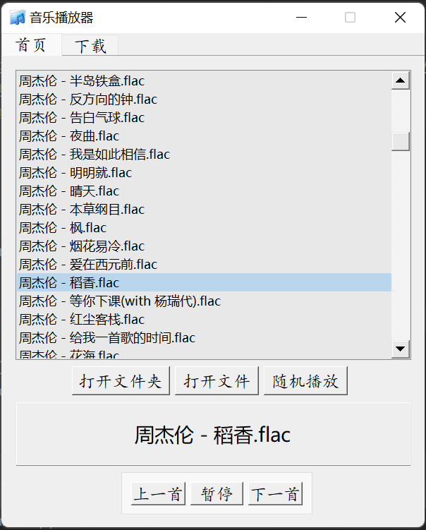
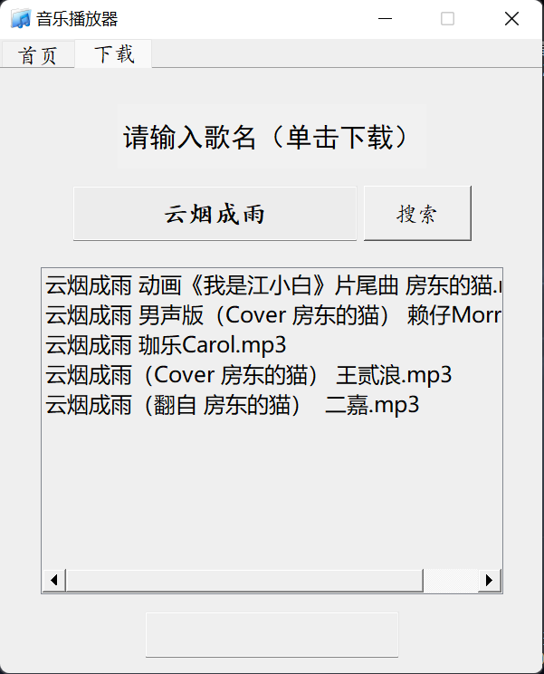
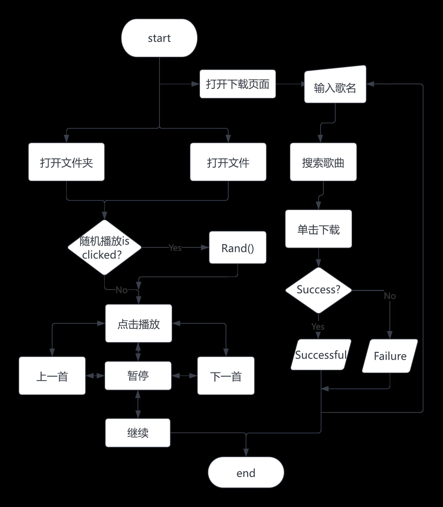
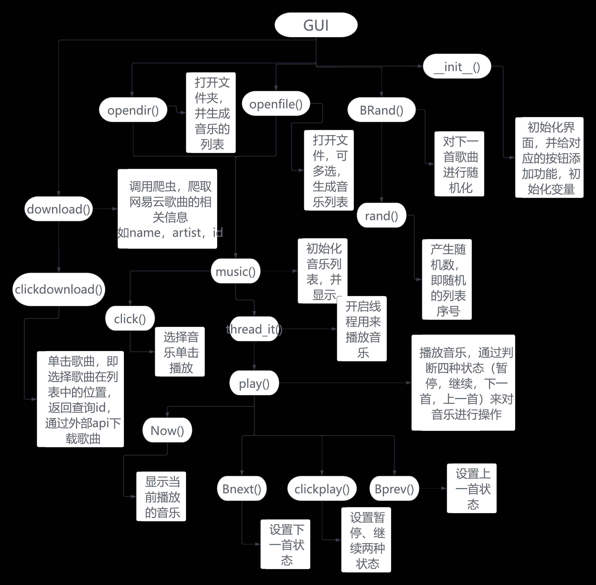

# Musipy
> Python Music Player

## product description:：
> &emsp;&emsp;This music player developed based on Python and Tkinter is a full-featured, easy-to-use local and online music player. It provides a user-friendly interface, supports local music playback in various audio formats, and can easily search and play music from all over the world through the online music search function. The design goal of this music player is to be simple and easy to use, and at the same time, it can meet users' basic needs for music players, such as play, pause, stop, adjust volume, etc.

## Design method：
> &emsp;&emsp;This development uses the Python language, taking advantage of its small amount of code, many ready-made libraries, and high development efficiency
>&emsp;&emsp;首先我们需要一个音乐播放器的界面，可用来设计界面的python库有Tkinter，PyQt5等，这里选择了设计简单，学习成本较低的PyQt5，来设计UI，通过QtDesigner软件，可以很快的做出一个界面，大大减少了开发成本，提高了效率。  
>&emsp;&emsp;音乐播放器的内部设计分为两个部分：一、本地音乐的打开与播放，二、网络音乐的搜索下载。本地音乐打开与播放时，首先选择文件夹，难题是如何使用鼠标选择文件中的某些歌曲。音乐的播放通过pygame模块进行控制。在学习过程中发现可以用爬虫实现网络音乐的下载，故学习如何使用爬虫技术进行爬取歌曲的id，然后调用外链进行下载。
## 用到的Python库：

- ### random用到random.randint()：

> &emsp;&emsp; random库是使用随机数的Python标准库,其中random.randint(a,b)随机生成一个（a,b）之间的整数，在本播放器中主要用于本地文件的随机播放。

- ### threading：

> &emsp;&emsp;多线程库，实现多个函数同时运行和爬虫，

- ### time用到time.sleep()：

> &emsp;&emsp;数推迟调用线程的运行，可通过参数secs指秒数，表示进程挂起的时间。播放音乐时，需要用到此函数进行播放的延迟

- ### os用到os.listdir() + os.path.basename()：

> &emsp;&emsp;返回指定路径下的文件和文件夹列表。
> os.path.basename(),返回path最后的文件名。若path以/或\结尾，那么就会返回空值。

- ### pygame：

> &emsp;&emsp;Pygame是被设计用来写游戏的python模块集合，Pygame是在优秀的SDL库之上开发的功能性包。使用python可以导入pygame来开发具有全部特性的游戏和多媒体软件，Pygame是极度轻便的并且可以运行在几乎所有的平台和操作系统上。此次程序设计中主要用来对音乐的播放暂停等控制。

- ### requests：

> &emsp;&emsp;在使用Python爬虫时，需要模拟发起网络请求，主要用到的库有requests库和python内置的urllib库，一般建议使用requests，它是对urllib的再次封装，其优势：Python爬虫时，更建议用requests库。因为requests比urllib更为便捷，requests可以直接构造get，post请求并发起，而urllib.request只能先构造get，post请求，再发起。

- ### PySide2：

> &emsp;&emsp;PySide2是基于Qt的官方Python库，提供了对Qt 5.122+框架的访问，可用于Python图形化界面开发，Qt是一种强大的图形用户界面构造工具。此次课程设计主要使用Qt进行相关界面的完善。

- ### cloudmusic：

> &emsp;&emsp;一个实现网易云爬虫的库，可实现音乐id、音乐名字、评论、歌单的爬取，并返回相关信息，自带下载外链(.m4a格式)。

### 播放界面：

### 下载界面：

### 程序设计流程图：

### 函数关系图：

### 尚未解决的问题：

[GitHub](https://github.com/menghuidream/Musicplayer)  
[Gitee](https://gitee.com/menghuidream/Musicplayer)  
